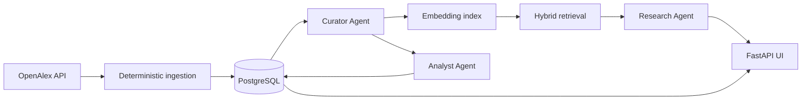

# Research Radar

Research Radar is a configurable research-intelligence system that discovers, evaluates,
summarizes, and indexes new scientific publications into a searchable, cited knowledge base.

It is deliberately agentic only where reasoning adds value. Collection, deduplication,
scheduling, and persistence remain deterministic; AI agents handle semantic curation,
technical summarization, and grounded synthesis.

## What it demonstrates

- Incremental scientific data ingestion from OpenAlex
- Structured LLM outputs with explicit Pydantic contracts
- Switchable OpenAI and local Ollama inference through one validated agent path
- Semantic curation with configurable topic-specific budgets
- Abstract-grounded summaries that avoid pretending to have read unavailable full text
- Hybrid PostgreSQL full-text and pgvector retrieval
- Cited RAG answers with prompt-injection boundaries
- Idempotent jobs, resumable processing stages, run telemetry, token usage, and cost estimates
- A responsive server-rendered UI, Docker packaging, CI, scheduled jobs, and deployment IaC

## Architecture



The hourly scheduler checks each topic's own cadence. A PostgreSQL advisory lock prevents
overlapping jobs, unique source IDs make ingestion idempotent, and explicit processing states
allow interrupted runs to continue instead of repeating completed work.

### Agent responsibilities

| Role | Input | Output |
| --- | --- | --- |
| Curator | Topic definition, titles, abstracts | Relevance score and concise rationale |
| Analyst | One selected paper's metadata and abstract | Typed research brief with findings and limitations |
| Research | A question and retrieved evidence | Grounded answer, citations, confidence, and caveats |

Discovery and indexing are intentionally not agents. Making predictable infrastructure depend
on model decisions would cost more and be harder to operate.

## Quick start

Requirements: Docker, Python 3.12+, [`uv`](https://docs.astral.sh/uv/), and optionally a free
OpenAlex API key. Choose either local Ollama (free, default) or the OpenAI API.

For the free local setup, start Ollama and download the two configured models once:

```bash
ollama serve
ollama pull qwen3:8b
ollama pull embeddinggemma
```

Then start Research Radar in another terminal:

```bash
cp .env.example .env

docker compose up -d db
uv sync
uv run radar init-db
uv run radar sync --force
uv run radar serve --reload
```

Open [http://localhost:8000](http://localhost:8000).

To use OpenAI instead, change these values in `.env` before starting the application:

```dotenv
AI_PROVIDER=openai
OPENAI_API_KEY=your-api-key
```

To run the complete stack in containers instead:

```bash
docker compose up --build -d
docker compose run --rm app radar sync --force
```

## Configuration

Topics live in [`topics.toml`](topics.toml), so adding a domain does not require code changes:

```toml
[[topics]]
slug = "efficient-ml"
name = "Efficient Machine Learning"
description = "Compression, quantization, distillation, and efficient inference."
query = "efficient machine learning quantization distillation inference"
cadence_hours = 24
lookback_days = 14
max_candidates = 25
summarize_top = 5
min_relevance_score = 60
```

`max_candidates` caps ingestion and embedding work per run. `summarize_top` caps the more
expensive Analyst Agent. Every curated candidate is indexed; only the best eligible candidates
receive a full research brief.

Environment variables:

| Variable | Purpose | Default |
| --- | --- | --- |
| `DATABASE_URL` | PostgreSQL connection string | Local Compose database |
| `AI_PROVIDER` | Inference backend: `ollama` or `openai` | `ollama` |
| `AI_CURATION_BATCH_SIZE` | Papers evaluated per model call | `8` |
| `OPENAI_API_KEY` | OpenAI authentication | Required only for `openai` |
| `OPENAI_MODEL` | Structured-output model | `gpt-5.4-mini` |
| `OPENAI_EMBEDDING_MODEL` | OpenAI embedding model | `text-embedding-3-small` |
| `OLLAMA_BASE_URL` | Ollama OpenAI-compatible API URL | `http://localhost:11434/v1` |
| `OLLAMA_MODEL` | Local structured-output model | `qwen3:8b` |
| `OLLAMA_EMBEDDING_MODEL` | Local embedding model | `embeddinggemma` |
| `OPENALEX_API_KEY` | Higher OpenAlex API allowance | Optional |
| `OPENALEX_EMAIL` | Contact address in the OpenAlex user agent | Placeholder |
| `TOPICS_PATH` | Topic configuration file | `topics.toml` |
| `ENABLE_PUBLIC_ASK` | Enable the model-backed Ask endpoint | `false` |
| `SOURCE_REPOSITORY_URL` | “View source” navigation link | Hidden when empty |

Ollama usage is reported as zero cost. OpenAI cost rates are configurable through
`OPENAI_INPUT_COST_PER_MILLION_USD`, `OPENAI_OUTPUT_COST_PER_MILLION_USD`, and
`EMBEDDING_COST_PER_MILLION_USD`. Update them when changing models or pricing.

## Commands

```bash
radar init-db                       # Create extensions, tables, and indexes
radar sync                          # Run topics whose cadence has elapsed
radar sync --topic agentic-ai      # Run one due topic
radar sync --topic agentic-ai --force
radar serve --reload
radar self-check                    # Run the small dependency-free invariant check
```

## Deployment

[`render.yaml`](render.yaml) provisions the Docker web service and a managed PostgreSQL database
in Render's Frankfurt region. Render PostgreSQL supports the pgvector extension used by the
schema.

1. Push the repository to GitHub and create a Render Blueprint from it.
2. Keep `AI_PROVIDER=openai`, then provide `OPENAI_API_KEY`, `OPENALEX_EMAIL`, and optionally
   `OPENALEX_API_KEY` when prompted.
3. Add the Render database's **external** connection string as the GitHub Actions secret
   `DATABASE_URL`.
4. Add `OPENAI_API_KEY` and optionally `OPENALEX_API_KEY` as Actions secrets, plus
   `OPENALEX_EMAIL` as an Actions variable.
5. Enable the `Research sync` workflow. It runs hourly and lets the application enforce the
   topic-specific cadences in `topics.toml`.

Keep `ENABLE_PUBLIC_ASK=false` for an unprotected public demo, or enable it only when model usage
is intentionally public. The browsing, digest, paper, and run pages remain fully usable without
exposing the model-backed endpoint.

## Data and evidence policy

Research Radar stores normalized metadata, abstracts, model outputs, and links. It does not
scrape publisher pages or treat a free-to-read URL as permission to redistribute a paper. Agent
briefs are labelled `abstract_only`, and Research Agent answers disclose that evidence boundary.

## Current scope

The first vertical slice uses one source, two interchangeable model providers, and exact vector
search. Add direct arXiv ingestion, full-text parsing for clearly licensed documents,
notifications, and approximate HNSW indexing only when corpus size or product usage justifies
them.

## License

[MIT](LICENSE)
